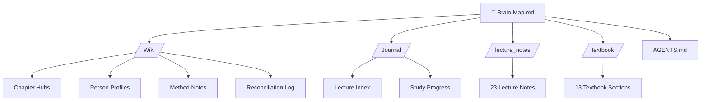

# 🧠 AM II Second Brain — Master Map

> [!abstract] Mission
> This vault is a **Living AI Second Brain** for the **Analytical Mechanics II (AM II)** course (Spring 2026), taught by [[Prof. Ali Akbar Abolhasani]]. It interconnects all lecture notes, textbook chapters, and concept synthesis notes into a navigable knowledge graph.
> 
> Open this in **Obsidian** and switch to **Graph View** to see the network.

---

## 🗺️ Course Architecture (Big Picture)

The course covers five major chapters, each with its own Wiki hub:

- **[[Chapter 8 - Central-Force Motion]]** — Two-body problem, reduced mass, Kepler orbits
- **[[Chapter 9 - Dynamics of a System of Particles]]** — Momentum, collisions, scattering, rockets
- **[[Chapter 10 - Non-Inertial Reference Frames]]** — Rotating frames, Coriolis, centrifugal forces
- **[[Chapter 11 - Dynamics of Rigid Bodies]]** — Moment of inertia tensor, Euler angles, gyroscopes
- **[[Chapter 12 - Coupled Oscillations and Normal Modes]]** — Small oscillations, eigenvalue problem, degeneracy

---

## 📂 Vault Structure

---

## 🔑 Core Concept Hubs

### Chapters
- [[Chapter 8 - Central-Force Motion]]
- [[Chapter 9 - Dynamics of a System of Particles]]
- [[Chapter 10 - Non-Inertial Reference Frames]]
- [[Chapter 11 - Dynamics of Rigid Bodies]]
- [[Chapter 12 - Coupled Oscillations and Normal Modes]]

### People
- [[Prof. Ali Akbar Abolhasani]] — Course professor & lecturer

### Methods & Techniques
- [[Lagrangian Mechanics]] — The unifying framework of the course
- [[Reduced Mass Method]] — Two-body → one-body reduction
- [[Eigenvalue Problem for Normal Modes]] — The secular determinant method
- [[Exam-Solver Workflow]] — The AI agent's step-by-step problem-solving protocol

---

## 📅 Lecture Timeline

> [!tip] Navigation
> Each lecture note links to the chapter hub it belongs to. See [[Journal/Lecture Index|Lecture Index]] for the full chronological list.

| Date | Chapter | Note |
|------|---------|------|
| Apr 4 | Ch. 9 | [[Apr 4 - Dynamics of Particles Intro]] |
| Apr 11 | Ch. 9 | [[Apr 11 - Falling Rope & Energy]] |
| Apr 13 | Ch. 9 | [[Apr 13 - System Dynamics Cont.]] |
| Apr 18 | Ch. 9 | [[Apr 18 - CM & Angular Momentum]] |
| Apr 20 | Ch. 9 | [[Apr 20 - System Dynamics Cont.]] |
| Apr 25 | Ch. 9 | [[Apr 25 - Scattering & Impulse]] |
| Apr 27 | Ch. 9 | [[Apr 27 - Scattering Cross-Sections]] |
| May 2 | Ch. 10 | [[May 2 - Non-Inertial Frames]] |
| May 4 | Ch. 10 | [[May 4 - Non-Inertial Frames Cont.]] |
| May 9 | Ch. 10 | [[May 9 - Non-Inertial Frames Cont.]] |
| May 11 | Ch. 11 | [[May 11 - Rigid Body Dynamics]] |
| May 16 | Ch. 11 | [[May 16 - Rigid Bodies Cont.]] |
| May 18 | Ch. 11 | [[May 18 - Rigid Bodies Cont.]] |
| May 23 | Ch. 11 | [[May 23 - Rigid Bodies Cont.]] |
| May 25 | Ch. 11 | [[May 25 - Rigid Bodies Cont.]] |
| May 30 | Ch. 11 | [[May 30 - Rigid Bodies Cont.]] |
| Jun 1 | Ch. 12 | [[Jun 1 - Coupled Oscillators]] |
| Jun 6 | Ch. 12 | [[Jun 6 - Weak Coupling & Beats]] |
| Jun 8 | Ch. 12 | [[Jun 8 - Small Oscillations & Orthogonality]] |
| Jun 13 | Ch. 12 | [[Jun 13 - Mode Orthogonality & Normal Coords]] |
| Jun 20 | Ch. 12 | [[Jun 20 - Normal Coordinate Algorithm]] |
| Jun 27 | Ch. 12 | [[Jun 27 - 3 Coupled Pendulums]] |
| Jun 29 | Ch. 12 | [[Jun 29 - Degeneracy & Loaded String]] |

---

## 📚 Textbook Reference

The textbook covers Chapters 8–9 in detail. See:
- [[Textbook Ch 8 - Central-Force Motion]]
- [[Textbook Ch 9 - System of Particles]]

---

## ⚠️ Quality Control

- [[Wiki/reconciliation-log|Reconciliation Log]] — Tracks contradictions, gaps, and stale info
- [[AGENTS.md]] — The AI agent's rulebook
- [[Exam-Solver Workflow]] — Problem-solving protocol

---

*Last updated: {{date}}*
