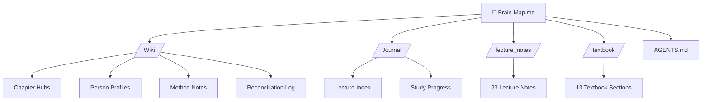

# 🧠 AM II Second Brain — Master Map

> [!abstract] Mission
> This vault is a **Living AI Second Brain** for the **Analytical Mechanics II (AM II)** course (Spring 2026), taught by [[Prof. Ali Akbar Abolhasani]]. It interconnects all lecture notes, textbook chapters, and concept synthesis notes into a navigable knowledge graph.
> 
> Open this in **Obsidian** and switch to **Graph View** to see the network.

---

## 🗺️ Course Architecture (Big Picture)

The course covers five major chapters, each with its own Wiki hub:

- **[[Chapter 8 - Central-Force Motion]]** — Two-body problem, reduced mass, Kepler orbits
- **[[Chapter 9 - Dynamics of a System of Particles]]** — Momentum, collisions, scattering, rockets
- **[[Chapter 10 - Non-Inertial Reference Frames]]** — Rotating frames, Coriolis, centrifugal forces
- **[[Chapter 11 - Dynamics of Rigid Bodies]]** — Moment of inertia tensor, Euler angles, gyroscopes
- **[[Chapter 12 - Coupled Oscillations and Normal Modes]]** — Small oscillations, eigenvalue problem, degeneracy

---

## 📂 Vault Structure

---

## 🔑 Core Concept Hubs

### Chapters
- [[Chapter 8 - Central-Force Motion]]
- [[Chapter 9 - Dynamics of a System of Particles]]
- [[Chapter 10 - Non-Inertial Reference Frames]]
- [[Chapter 11 - Dynamics of Rigid Bodies]]
- [[Chapter 12 - Coupled Oscillations and Normal Modes]]

### People
- [[Prof. Ali Akbar Abolhasani]] — Course professor & lecturer

### Methods & Techniques
- [[Lagrangian Mechanics]] — The unifying framework of the course
- [[Reduced Mass Method]] — Two-body → one-body reduction
- [[Eigenvalue Problem for Normal Modes]] — The secular determinant method
- [[Exam-Solver Workflow]] — The AI agent's step-by-step problem-solving protocol

---

## 📅 Lecture Timeline

> [!tip] Navigation
> Each lecture note links to the chapter hub it belongs to. See [[Lecture Index]] for the full chronological list.

| Date | Chapter | Note |
|------|---------|------|
| Apr 4 | Ch. 9 | [[Note Apr 4, 2026|Apr 4]] |
| Apr 11 | Ch. 9 | [[Note Apr 11, 2026|Apr 11]] |
| Apr 13 | Ch. 9 | [[Note Apr 13, 2026|Apr 13]] |
| Apr 18 | Ch. 9 | [[Note Apr 18, 2026|Apr 18]] |
| Apr 20 | Ch. 9 | [[Note Apr 20, 2026|Apr 20]] |
| Apr 25 | Ch. 9 | [[Note Apr 25, 2026|Apr 25]] |
| Apr 27 | Ch. 9 | [[Note Apr 27, 2026|Apr 27]] |
| May 2 | Ch. 10 | [[Note May 2, 2026|May 2]] |
| May 4 | Ch. 10 | [[Note May 4, 2026|May 4]] |
| May 9 | Ch. 10 | [[Note May 9, 2026|May 9]] |
| May 11 | Ch. 11 | [[Note May 11, 2026|May 11]] |
| May 16 | Ch. 11 | [[Note May 16, 2026|May 16]] |
| May 18 | Ch. 11 | [[Note May 18, 2026|May 18]] |
| May 23 | Ch. 11 | [[Note May 23, 2026|May 23]] |
| May 25 | Ch. 11 | [[Note May 25, 2026|May 25]] |
| May 30 | Ch. 11 | [[Note May 30, 2026|May 30]] |
| Jun 1 | Ch. 12 | [[Note Jun 1, 2026|Jun 1]] |
| Jun 6 | Ch. 12 | [[Note Jun 6, 2026|Jun 6]] |
| Jun 8 | Ch. 12 | [[Note Jun 8, 2026|Jun 8]] |
| Jun 13 | Ch. 12 | [[Note Jun 13, 2026|Jun 13]] |
| Jun 20 | Ch. 12 | [[Note Jun 20, 2026|Jun 20]] |
| Jun 27 | Ch. 12 | [[Note Jun 27, 2026|Jun 27]] |
| Jun 29 | Ch. 12 | [[Note Jun 29, 2026|Jun 29]] |

---

## 📚 Textbook Reference

The textbook covers Chapters 8–9 in detail. See:
- [[Textbook Ch 8 - Central-Force Motion]]
- [[Textbook Ch 9 - System of Particles]]

---

## ⚠️ Quality Control

- [[reconciliation-log]] — Tracks contradictions, gaps, and stale info
- [[AGENTS]] — The AI agent's rulebook
- [[Exam-Solver Workflow]] — Problem-solving protocol

---

*Last updated: {{date}}*
